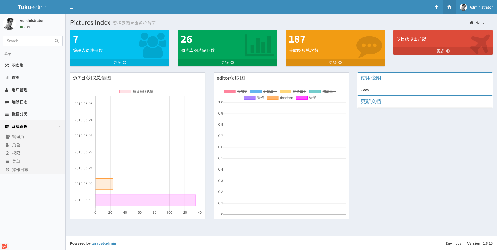
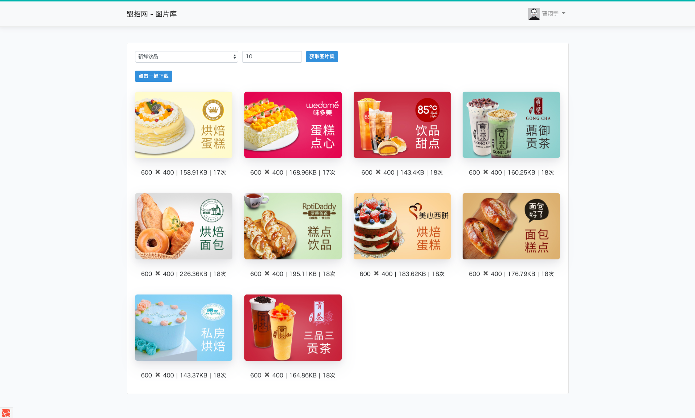

## About Tuku

图库系统是盟招网编辑用图系统，主要致力于完善SEO人员与编辑人员配合理念而成！主要功能如下：

- 由SEO人员后台统一传图片到服务器
- 编辑人员可在前台搜索条件【类别】和【数量】从而获取相应的图片
- 获取的图片都会显示宽、高、大小！每张图片都有自己的生命周期（即推荐次数）
- 向编辑人员推荐的图片是以 搜索条件+最低推荐次数 获取的
- 编辑人员获取后可选择 【一键打包下载】

以上为本系统的基本功能;

## 后台基本功能

后台系统基于Laravel-admin开发而成

tuku后台主要包含如下功能：

- ###### <a href="http://tuku.local/admin">首页（统计）</a>

  - 注册人员（跳转用户管理）、图片库总数（跳转图片库）、获取图片总数、今日获取图片数（跳转编辑日志）
  - 统计表：近7日获取总量图（柱状图）、编辑人员每日获取图（饼状图）
  - 使用说明、近期更新说明

- ###### 用户管理

  - 前端注册用户列表
  - 验证邮箱时间（可编辑）如为空即没有验证邮箱
  - 点击用户名可查看近10次的编辑日志

- ###### 编辑日志

  - 前台获取图片的列表（获取了哪些图片、类别、时间、IP地址、总数）以及备注（可编辑）
  - 筛选功能：时间、栏目、备注、编辑人
  - 注：如需获取本日某位编辑人的获取量，可结合筛选与底部统计获取
    1. 选择时间 开始时间为今日-结束时间为明日
    2. 选择编辑人 点击筛选
    3. 在 SUM 列底部即可看到 该编辑人员近日获取图片总量

- ###### 分类管理

  - 无限极分类：包含了名称、描述、排序等功能
  - 流程：右侧添加表单，提交后在左侧显示！后点击左侧的保存完成
  - 技巧：左侧类别列表可拖拽排序

- ###### 图片库（图片管理）

  - 包含功能：图片的增删改、批量上传（也可拖拽上传）、批量删除
  - 技巧：后台的右上角的➕是图片库的新增快捷键，小房子是返回前台快捷键！列表图片可点击放大
  - id、图片大小、推荐次数、初始推荐次数 均可点击排序
  - 表格右上角的蓝黑色按钮可调节显示列的选择

- ###### 系统管理（laravel-admin自带）

  - 具体操作查看 laravel-admin 文档

- 注释：后台用户可点击右上角头像中的设置更换自定义头像、更改名称和密码！

## 前端基本功能

前端主要给编辑人员提供方便的图片获取及下载功能；

为安全和便于统计，前台设置了诸多限制：

- 前端用户需注册账号，并登陆切验证邮箱后才可获取图片（便于供后台查看获取的编辑日志信息）
- 前端用户获取图片需选择类别栏目以及填写需要的图片数
- 为防止恶意刷取图片的生命周期（推荐次数）每次获取图片均有间隔5分钟
  - 间隔期间刷新网页获取图片不变，且时间不会重新计时

为方便前端用户，本系统提供一键打包下载功能

- 当搜索完成并获取图片后，即会显示一件下载
- 点击一键下载系统会打包成zip文件并重命名图片（md5）
- 注：如点击一键下载无反应，乃是浏览器问题！请更换更高版本的浏览器

## 安全漏洞

如果您发现本系统中存在安全漏洞，请发送电子邮件至[646460179@qq.com]（mailto：646460179@qq.com）给jianyue1024。所有安全漏洞都将得到及时解决。

## License

The Laravel framework is open-sourced software licensed under the [MIT license](https://opensource.org/licenses/MIT).